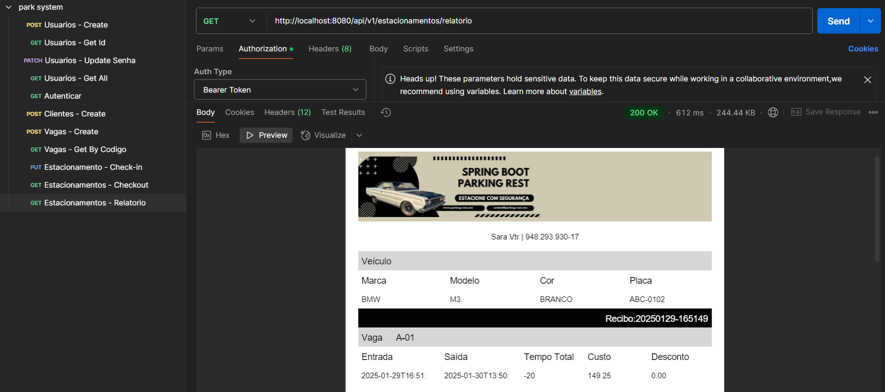

# Sistema de Gerenciamento de Estacionamento

## Descrição

Este projeto é uma API REST desenvolvida para facilitar a gestão de um estacionamento. Com ela, é possível administrar vagas, registrar entradas e saídas de veículos, gerar relatórios e gerenciar usuários com diferentes níveis de acesso.

## Tecnologias Utilizadas

- **Java 17**
- **Spring Boot**
- **Spring Security com JWT**
- **JPA/Hibernate**
- **Banco de Dados H2 (para testes) e MySQL**
- **Swagger para documentação**
- **JasperReports para geração de relatórios em PDF**
- **Postman para testas os EndPoints**

## Funcionalidades

### 🔐 Autenticação e Segurança

- Implementação do Spring Security com JWT para controle de acesso
- Perfis de usuários diferenciados (admin e usuário comum)
- Proteção dos endpoints via autenticação

### 👤 Gerenciamento de Usuários

- Cadastro, atualização, listagem e exclusão de usuários
- Alteração de senha
- Listagem de usuários disponível apenas para administradores

### 🚗 Controle de Estacionamento

- Cadastro e gerenciamento de vagas disponíveis
- Registro de check-in e check-out de veículos
- Consulta de estacionamento por CPF e perfil do cliente
- Relacionamento entre clientes e vagas ocupadas

### 📊 Relatórios

- Geração de relatórios detalhados em formato PDF via JasperReports
- Consulta de relatórios por CPF

## Como Executar o Projeto

### 📌 Pré-requisitos

- Java 17 instalado
- Banco de dados configurado (MySQL para produção ou H2 para testes)
- Maven configurado

### 🚀 Passos para rodar a aplicação

1. Clone o repositório:
   ```sh
   git clone https://github.com/luixsouza/demo-park-api.git
   ```
2. Acesse o diretório do projeto:
   ```sh
   cd parking-system
   ```
3. Configure o banco de dados no arquivo `application.properties`.
   ```sh
   spring.datasource.driverClassName=com.mysql.cj.jdbc.Driver
   spring.datasource.url=jdbc:mysql://localhost:3306/demo_park?useSSL=false&allowPublicKeyRetrieval=true&serverTimezone=America/Sao_Paulo
   spring.datasource.username=seuUser
   spring.datasource.password=suaSenha
   ```
5. Compile e execute a aplicação:
   ```sh
   mvn spring-boot:run
   ```
6. Acesse a documentação no Swagger:
   ```sh
   http://localhost:8080/swagger-ui.html`
   ```

## Exemplo de Relatório Gerado


## 📩 Contato

- **LinkedIn:** [linkedin.com/in/luixsouza](https://linkedin.com/in/luixsouza)